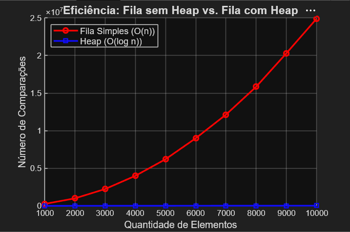

# Fila de Prioridade: Com Heap vs. Sem Heap

> Trabalho prático da disciplina de **Estrutura de Dados**  
> Instituto de Computação (IC) — Universidade Federal de Alagoas (UFAL)  
> Professor: **Márcio Ribeiro**


---

## Sobre o Projeto

Este projeto implementa e compara duas abordagens para **fila de prioridade** em C:

- **Fila Simples** — lista encadeada ordenada, com inserção O(n)
- **Fila com Heap** — min-heap baseado em array, com inserção O(log n)

O objetivo é evidenciar, de forma visual e quantitativa, a diferença de eficiência entre as duas estruturas conforme o volume de dados cresce.

---

## Como Compilar e Executar

### Pré-requisito
Ter o GCC instalado.

### Compilar
```bash
gcc gerarentradas.c -o gerarentradas
```

### Executar
```bash
# Linux / Mac
./gerarentradas

# Windows
.\gerarentradas.exe
```

O programa gera o arquivo `resultados.csv` na pasta atual, pronto para ser plotado no MATLAB.

---

## Como Funciona

O programa testa filas de **1.000 a 10.000 elementos** (em passos de 1.000). Para cada tamanho:

1. Sorteia números aleatórios entre 0 e 49.999
2. Insere os mesmos números nas duas estruturas
3. Conta o número de comparações feitas por cada uma
4. Salva os resultados no CSV

### Lógica de Prioridade
Em ambas as implementações, **menor valor = maior prioridade** (min-heap / fila crescente).

### Complexidade
| Estrutura | Inserção | Remoção |
|-----------|----------|---------|
| Lista encadeada | O(n) | O(1) |
| Heap (array) | O(log n) | O(log n) |

---

## Resultado

O gráfico abaixo foi gerado a partir do `resultados.csv` via MATLAB e ilustra claramente a diferença de crescimento entre as duas abordagens:



A curva vermelha (lista encadeada) cresce de forma quadrática em número de comparações, enquanto a curva azul (heap) permanece próxima de zero — confirmando o comportamento O(n) vs O(log n) na prática.

---

## Conceitos Envolvidos

- **Min-Heap**: árvore binária completa onde o pai sempre tem valor menor ou igual aos filhos. Representada aqui como array, onde o pai do índice `i` está em `(i-1)/2` e os filhos em `2i+1` e `2i+2`.
- **Heapify Up**: reposicionamento do elemento inserido subindo na árvore até restaurar a propriedade do heap.
- **Heapify Down**: reposicionamento da raiz após remoção, descendo até restaurar a propriedade.
